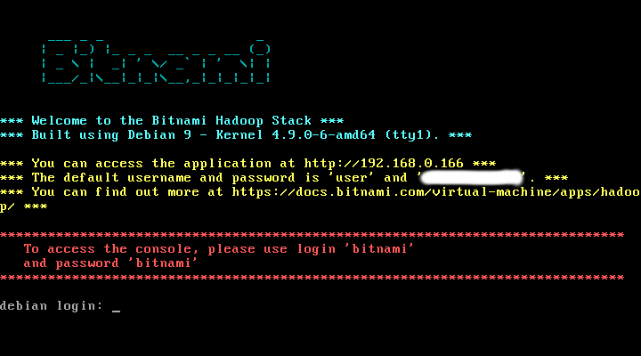

# Instalación de Hadoop y ejecución del MapReduce nulo

## Instalación de Hadoop

La forma más fácil de instalar Hadoop es utilizar alguna de las máquinas virtuales que se encuentran disponibles para su descarga en Internet y que ya tienen todo el entorno configurado.

Por ejemplo, Cloudera proporciona varias máquinas en su [página web](http://www.cloudera.com/content/cloudera/en/documentation/core/latest/topics/cloudera_quickstart_vm.html). Las máquinas virtuales de Clouder (*Cloudera QuickStart VMs*) traen todo el entorno ya configurado, ahorrando mucho tiempo. Están disponibles para `VMWare`, `KVM` y `VirtualBox`. El problema fundamental de dichas máquinas virtuales es que requieren bastante memoria RAM (recomendado un mínimo de **4GB dedicados al *guest*** según Cloudera). Aunque pueden funcionar asignándoles menos memoria, el desempeño se reduce bastante y notarás más esperas.

Por otro lado, Bitnami también proporciona una máquina virtual con Hadoop preinstalado algo más ligera. Puedes descargarla de la [web de Bitnami](https://bitnami.com/stack/hadoop/virtual-machine). En el momento de realizar este tutorial, la última versión es [bitnami-hadoop-3.0.0-2-linux-debian-9-x86_64.ova](https://bitnami.com/redirect/to/183957/bitnami-hadoop-3.0.0-2-linux-debian-9-x86_64.ova). Como puedes observar, se trata de una versión para VirtualBox.

Una última opción es, si disponéis de un sistema operativo GNU/Linux, instalaros Hadoop. Una forma fácil de realizar la instalación es utilizar *Cloudera manager installer*. El [instalador de Cloudera](http://archive.cloudera.com/cm5/installer/latest/cloudera-manager-installer.bin) debería poder configurar tu equipo de forma fácil (está preparado para bastantes distribuciones conocidas). Bitnami también tiene su [instalador](https://bitnami.com/redirect/to/183949/bitnami-hadoop-3.0.0-2-linux-x64-installer.run).

### Instalación de la máquina de Bitnami utilizando VirtualBox

1. [Descarga](https://www.virtualbox.org/wiki/Downloads) e instala *VirtualBox* en tu equipo.
2. [Descarga](https://bitnami.com/stack/hadoop/virtual-machine) la última versión de la máquina virtual de Cloudera.
3. Arranca *VirtualBox* y selecciona "Importar servicio virtualizado". Selecciona el archivo OVA que has descargado.
4. Una vez terminada la importación (que llevará un tiempo), debería aparecer la máquina virtual.
5. Pulsando el botón derecho, accede a la configuración de la máquina virtual. Corrige la cantidad de memoria RAM y memoria de vídeo para adaptarla a tu equipo.
6. Finalmente, arranca la máquina virtual (paciencia, tarda bastante). Aparecerá una imagen como la siguiente:


7. La máquina virtual incluye un adaptador puente, que hace que esté disponible en la misma red en la que estemos conectados. Una vez arrancada, se nos indica la forma de acceder a la máquina virtual. Por ejemplo, si tu ordenador está en la red privada `192.168.0.0`, el cluster Hadoop estará disponible a través de `192.168.0.166`.
8. Como puedes ver, se puede acceder al cluster Hadoop para su administración abriendo un navegador en el anfitrión e introduciendo la dirección `http://192.168.0.166` con el siguiente usuario y contraseña:
    - User: `user`
    - Password: la indicada en la imagen anterior.
8. Para habilitar el acceso SSH, puedes seguir las instrucciones indicadas en la [web de Bitnami](https://docs.bitnami.com/virtual-machine/faq/#how-to-enable-the-ssh-server). Haz un primer *login* con las siguientes credenciales:
    - User: `bitnami`
    - Password: `bitnami`
La máquina virtual te solicitará que cambies la contraseña.
9.  Después, deberás escribir los siguientes comandos:
```bash
$ sudo rm -f /etc/ssh/sshd_not_to_be_run
$ sudo systemctl enable ssh
$ sudo systemctl start ssh
```
10. Ya tienes acceso SSH. Puedes utilizar una conexión `sftp://` desde el navegador para facilitar la interacción con la máquina virtual. Si tu Sistema Operativo anfitrión es GNU/Linux, pulsa `Ctrl+L` y escribe `sftp://bitnami@192.168.0.166/home/bitnami`.
11. Por otro lado, abre una terminal para interactuar con la máquina y conéctate por SSH:
```bash
pedroa@pedroa-laptop ~ $ ssh bitnami@192.168.0.166
bitnami@192.168.0.166's password:
Linux debian 4.9.0-6-amd64 #1 SMP Debian 4.9.82-1+deb9u3 (2018-03-02) x86_64

The programs included with the Debian GNU/Linux system are free software;
the exact distribution terms for each program are described in the
individual files in /usr/share/doc/*/copyright.

Debian GNU/Linux comes with ABSOLUTELY NO WARRANTY, to the extent
permitted by applicable law.
       ___ _ _                   _
      | _ |_) |_ _ _  __ _ _ __ (_)
      | _ \ |  _| ' \/ _` | '  \| |
      |___/_|\__|_|_|\__,_|_|_|_|_|

  *** Welcome to the Bitnami Hadoop 3.0.0-2 ***
  *** Documentation:  https://docs.bitnami.com/virtual-machine/apps/hadoop/ ***
  ***                 https://docs.bitnami.com/virtual-machine/ ***
  *** Bitnami Forums: https://community.bitnami.com/ ***
Last login: Sat Apr  7 18:02:10 2018
bitnami@debian:~$
```
La máquina virtual instalada incluye una versión mínima de Debian con Hadoop y una versión bastante reducida del JDK de Java.

### Instalación de la máquina de Cloudera utilizando VirtualBox

1. [Descarga](https://www.virtualbox.org/wiki/Downloads) e instala *VirtualBox* en tu equipo.
2. [Descarga](http://www.cloudera.com/content/cloudera/en/documentation/core/latest/topics/cloudera_quickstart_vm.html) la última versión de la máquina virtual de Cloudera.
3. Descomprime la máquina virtual. Está comprimida con *7zip* (puede que necesites [instalarlo](http://www.7-zip.org/)).
4. Arranca *VirtualBox* y selecciona "Importar servicio virtualizado". Selecciona el archivo OVF ya descomprimido.
5. Una vez terminada la importación (que llevará un tiempo), debería aparecer la máquina virtual. Vamos a configurar *VirtualBox* para que se cree una red de "solo-anfitrión". `Archivo->Preferencias->Red->Redes solo-anfitrión`. Añádela con los parámetros por defecto. Después, configuramos la máquina virtual para que la use `Botón derecho->Configuración->Red->Adaptador2->Habilitar->Conectado a -> Adaptador solo anfitrión`. De esta forma, podremos acceder por `ssh` a nuestra máquina virtual (utilizando `ssh` o `putty`) a través de la dirección `192.168.56.101` (esta sería la dirección por defecto que se asigna a la red de "solo-anfitrión".
6. Finalmente, arranca la máquina virtual (paciencia, tarda bastante). Una vez arrancada, deberíamos poder acceder desde el anfitrión a la dirección <http://localhost:8088>, dónde podremos ver la interfaz del administrador de recursos. Podrás ver que éste y varios puertos están redirigidos por NAT en el Adaptador 1 de tu máquina virtual.
7. El usuario y contraseña por defecto para Cloudera es:
    - User: `cloudera`
    - Password: `cloudera`
8. Puedes utilizar una conexión `sftp://` desde el navegador para facilitar la interacción con Cloudera. Si tu Sistema Operativo anfitrión es GNU/Linux, pulsa `Ctrl+L` y escribe `sftp://cloudera@192.168.56.101/home/cloudera`.

La máquina virtual instada incluye el siguiente *software* (`cloudera-quickstart-vm-5.4.0-0-virtualbox`):

- CentOS 6.4
- JDK (1.7.0_67).
- Hadoop 2.6.0.
- Eclise 4.2.6 (Juno).

## Manejo del HDFS

El sistema de ficheros de Hadoop (HDFS) se puede manejar a través de tres interfaces:

1. Interfaz de línea de comandos, mediante el comando `hadoop fs [opciones]`.
2. Interfaz web del *NameNode*. En la máquina de Cloudera podrás hacerlo a través de <http://localhost:50070/>. En la máquina Bitnami todos los puertos están deshabilitados por defecto para su acceso desde el anfitrión. La lista de puertos están en [este enlace](https://docs.bitnami.com/virtual-machine/apps/hadoop/#hadoop-ports). Nos interesa el del *NameNode*. Podemis habilitarlo mediante un [túnel SSH](https://docs.bitnami.com/virtual-machine/faq/#how-to-access-a-server-using-an-ssh-tunnel):
```bash
pedroa@pedroa-laptop ~ $ ssh -N -L 9870:127.0.0.1:9870 bitnami@192.168.0.166
bitnami@192.168.0.166's password:
```
Ahora ya podrás entrar por  <http://localhost:9870/>. En cualquier caso, desde esta interfaz podrás acceder al HDFS y a varias opciones asociadas al mismo.
3. El API de programación.

La interfaz de línea de comandos incluye, por ejemplo, los siguientes comandos:

| Comando | Acción
| --------|---------
| `hadoop fs -ls <path>` | Lista ficheros |
| `hadoop fs -cp <src> <dst>` | Copia ficheros HDFS a HDFS
| `hadoop fs -mv <src> <dst>` | Mueve ficheros HDFS a HDFS |
| `hadoop fs -rm <path>` | Borra ficheros en HDFS |
| `hadoop fs -rmr <path>` | Borra recursivamente |
| `hadoop fs -cat <path>` | Muestra fichero en HDFS |
| `hadoop fs -mkdir <path>` | Crea directorio en HDFS |
| `hadoop fs -chmod ...` | Cambia permisos de fichero |
| `hadoop fs -chown ...` | Cambia propietario/grupo de fichero |
| `hadoop fs -put <local> <dst>` | Copia de local a HDFS |
| `hadoop fs -get <src> <local>` | Copia de HDFS a local |


## El *MapReduce* nulo

Para entender mejor el modo de operación de *MapReduce*, comenzamos desarrollando un programa [`Null.java`](code/ejemplo1/Null.java) que, en principio, no hace nada, dejando, por tanto, que se ejecute un trabajo *MapReduce* con todos sus parámetros por defecto:
```java
import java.io.IOException;

import org.apache.hadoop.fs.Path;
import org.apache.hadoop.mapreduce.Job;
import org.apache.hadoop.mapreduce.lib.input.FileInputFormat;
import org.apache.hadoop.mapreduce.lib.output.FileOutputFormat;

public class Null {
	public static void main(String[] args) throws Exception {
		if (args.length != 2) {
  			System.err.println("Uso: null in out");
			System.exit(2);
		}
		// Crea un trabajo MapReduce
		Job job = Job.getInstance();
		// Especifica el JAR del mismo
		job.setJarByClass(Null.class);

		// Especifica directorio de entrada y de salida
		FileInputFormat.addInputPath(job, new Path(args[0]));
		FileOutputFormat.setOutputPath(job, new Path(args[1]));

		// Arranca el trabajo y espera que termine
		System.exit(job.waitForCompletion(true) ? 0 : 1);
	}
}
```

Ahora tenemos que crear un directorio en el HDFS, utilizando el CLI de HDFS. Abre una sesión en la máquina virtual (desde VirtualBox o conéctate por SSH) y escribe:
```bash
hadoop fs -mkdir input
```
Para este primer ejemplo, créate una carpeta `ejemplo1` en el `$HOME` (local) de tu usuario. Ahora añade algunos ficheros. Para ello, crea con `gedit` los ficheros (por ejemplo, `f1.txt` y `f2.txt`), añade el texto que quieras y luego cópialos al HDFS con:
```bash
hadoop fs -put f*.txt input/
```
Comprueba como ha quedado el sistema de ficheros.

Ahora debes crear el fichero [`Null.java`](code/ejemplo1/Null.java) (en local) y compilar y ejecutar este programa especificando como primer parámetro el nombre de ese directorio y como segundo el nombre de un directorio, que no debe existir previamente, en el que se almacenará la salida del trabajo. Necesitarás el compresor `jar` para crear el ejecutable Java. En el caso de la máquina de Bitnami, tendrás que instalarlo:
```bash
bitnami@debian:~$ sudo apt-get install fastjar
```
Además, creamos un alias para que podamos usarlo utilizando `jar` (acuérdate de salir y entrar de la sesión después de actualizar el `.bashrc`):
```bash
bitnami@debian:~$ echo "alias jar='fastjar'" >> .bashrc
```
Compilamos el código, creamos un `jar` y lo ejecutamos en Hadoop:
```bash
javac  -cp `hadoop classpath` *.java  # compilar
jar cvf Null.jar *.class # crear el JAR
hadoop jar Null.jar Null input output # nombre del JAR, de la clase principal y args del programa
```
Echa un vistazo al contenido del directorio de salida, donde, entre otros, habrá un fichero denominado `part-r-00000`.
```bash
[cloudera@quickstart ejemplo1]$ hadoop fs -ls output
Found 2 items
-rw-r--r--   1 cloudera cloudera          0 2015-06-05 04:15 output/_SUCCESS
-rw-r--r--   1 cloudera cloudera         77 2015-06-05 04:15 output/part-r-00000
[cloudera@quickstart ejemplo1]$ hadoop fs -ls output/part-r-00000
-rw-r--r--   1 cloudera cloudera         77 2015-06-05 04:15 output/part-r-00000
[cloudera@quickstart ejemplo1]$ hadoop fs -cat output/part-r-00000
0	sadfsadf
0	asdfasfd
9	asdfasdf
9	qwerqwer
18	qwerwqer
18	qwer qwer
27
28
```

*¿Qué relación ves entre el contenido de este fichero y los ficheros de texto usados en la prueba?*.

En general, al especificar un trabajo *MapReduce* tenemos que incluir los elementos que se enumeran a continuación (en el caso de [`Null.java`](code/ejemplo1/Null.java), muchos no aparecen porque se toman los valores por defecto):

> job.setInputFormatClass(TextInputFormat.class);

Esto especifica el formato de entrada. En este caso, hemos usado `TextInputFormat` que es una clase que representa datos de tipo texto y que considera cada línea del fichero como un registro invocando, por tanto, la función **map** del programa por cada línea. Al invocar a **map**, le pasaremos como clave el *offset* (desplazamiento) dentro del fichero correspondiente al principio de la línea. El tipo de la clave será `LongWritable`. `Writable` es el tipo *serializable* que usa *MapReduce* para gestionar todos los datos, que en este caso son de tipo `long`. Como valor, al invocar a **map** pasaremos el contenido de la línea (de tipo `Text`, la versión `Writable` de un `String`).

> job.setMapperClass(Mapper.class);

Esto especifica cuál es la clase utilizada para el **map**. En este caso, utilizamos el `Map` identidad, que simplemente copia lo que llega a la salida (sin modificarlo).

> job.setMapOutputKeyClass(LongWritable.class);

Este es el tipo de datos de la clave generada por **map**. Dado que la función **map** usada copia la clave recibida, es de tipo `LongWritable`.

> job.setMapOutputValueClass(Text.class);

El tipo de datos del valor generado por **map**. Dado que la función **map** usada copia el valor recibido, es de tipo `Text`.

> job.setPartitionerClass(HashPartitioner.class);

Esta clase es la que vamos a utilizar para realizar las particiones (decidir qué **reduce** se le asigna a cada clave). Por defecto, utilizamos el basado en hash (`hash(key) mod R`).

> job.setNumReduceTasks(1);

Sólo vamos a utilizar un *reducer*, por eso generamos un solo fichero de salida.

> job.setReducerClass(Reducer.class);

Con esto se especifica la clase del *reducer*. En este caso, utilizamos el `Reducer` identidad, que copia los pares `<clave,valor>` que llegan al fichero de salida.

> job.setOutputKeyClass(LongWritable.class);

El tipo de datos de la clave generada por **reduce** y por **map**, excepto si se ha especificado uno distinto para **map** usando `setMapOutputKeyClass`. Dado que la función **reduce** usada copia la clave recibida, es de tipo `LongWritable`.

> job.setOutputValueClass(Text.class);

El tipo de datos del valor generado por **reduce** y por **map**, excepto si se ha especificado uno distinto para **map** usando `setMapValueKeyClass`. Dado que la función **reduce** usada copia el valor recibido, es de tipo `Text`.

> job.setOutputFormatClass(TextOutputFormat.class);

Este formato de salida es de tipo texto y consiste en la clave y el valor separados, por defecto, por un tabulador (para pasar a texto los valores generados por **reduce**, el entorno de ejecución invoca el método `toString` de las respectivas clases `Writable`).

Para terminar esta primera toma de contacto, hay que explicar que el mandato **hadoop** gestiona sus propios argumentos de la línea de comandos (veremos un ejemplo en la siguiente sección). Es necesario separar dentro de los argumentos de la línea de comandos aquellos que corresponden a *Hadoop* y los que van destinados a la aplicación. La clase `Tool` facilita este trabajo. A continuación, se presenta la nueva versión de la clase [`Null.java`](code/ejemplo2/Null.java) usando este mecanismo. Trabaja en la carpeta local `$HOME/ejemplo2`.

```java
import java.io.IOException;

import org.apache.hadoop.fs.Path;
import org.apache.hadoop.mapreduce.Job;
import org.apache.hadoop.mapreduce.lib.input.FileInputFormat;
import org.apache.hadoop.mapreduce.lib.output.FileOutputFormat;

import org.apache.hadoop.util.Tool;
import org.apache.hadoop.util.ToolRunner;
import org.apache.hadoop.conf.Configured;

public class Null extends Configured implements Tool {
	public int run(String[] args) throws Exception {
		if (args.length != 2) {
  			System.err.println("Usage: null in out");
			System.exit(2);
		}
		Job job = Job.getInstance(getConf()); // le pasa la config.

		job.setJarByClass(getClass()); // pequeño cambio

		FileInputFormat.addInputPath(job, new Path(args[0]));
		FileOutputFormat.setOutputPath(job, new Path(args[1]));
		return job.waitForCompletion(true) ? 0 : 1;
	}

	public static void main(String[] args) throws Exception {
		int resultado = ToolRunner.run(new Null(), args);
		System.exit(resultado);
	}
}
```

## Referencias

Este tutorial se ha realizado basándonos en gran medida en los siguientes tutoriales:

1. [Introducción a la programación MapReduce en Hadoop](http://laurel.datsi.fi.upm.es/docencia/asignaturas/ppd). Universidad Politécnica de Madrid (UPM).
2. [Hadoop Tutorial](http://web.stanford.edu/class/cs246/homeworks/tutorial.pdf) Stanford University.
